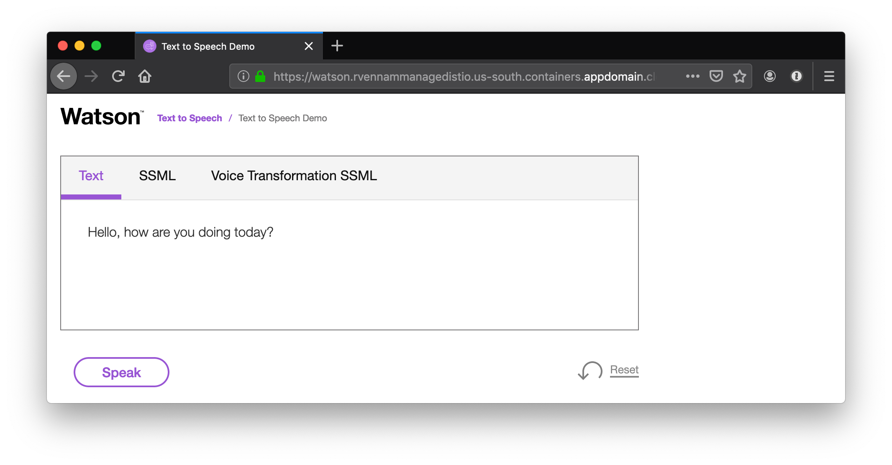

# Deploy an application with IBM Watson services

In this lab, set up an application to leverage the Watson Tone Analyzer service. If you have yet to create a cluster, please refer to first lab of this course.

# Update the credentials.json file
1. Change to the Excercise 4 directory:

    ```
    cd ../exercise-4
    ```

2. Edit the credentials.json file found in `kube-code-camp/exercise-4/watson/credentials.json`. Remember that to edit this file, you need to click the pencil icon, edit the file at `kube-code-camp/exercise-4/watson/credentials.json` and then save the file. The apikey required for this section of the lab was provided for you as a part of the grant-clusters app. Update the apikey value now, and save the file.

3. Create a Kubernetes Secret from on the credentials stored in this file.

    ```
    kubectl create secret generic apikey --from-file=./watson/credentials.json 
    ```

## Build the image for the Watson Text to Speech application

1. Create a unique application name for the watson app you're about to build. Something like `bmv-watson-1111`

    ```
    export MYWATSONAPP=<your_unique_name>
    ```

2. Build the image, and push it to the IBM Cloud Container Registry using the `ibmcloud cr build` command.

   ```
   ibmcloud cr build -t $MYREGISTRY/$MYNAMESPACE/$MYWATSONAPP ./watson
   ```

3. In watson-deployment.yml, update the image tag with the registry path to the images you just created. Remember, to update a file click the pencil icon, find the file at `kube-code-camp/exercise-4/watson-deployment.yml`. Remember to save once you've edited it.

    ```yml
    spec:
      containers:
        - name: watson-text-to-speech
          image: "us.icr.io/<namespace>/<appname>" # edit here!
          # change to the path of the watson image you just built and pushed
          # ex: image: "us.icr.io/code-camp/bmv-watson-1234"
    ```

## Share the Watson API Credentials with your application
Take a close look at the watson-deployment.yaml and look for the volumeMounts and volumes section. This is how we tell Kubernetes to share the secret we created with the container. It writes the contents of the secret into /var/credentials of the container.

  ```yml
  volumeMounts:
    - mountPath: /var/credentials
      name: apikeyvol
  ...
  volumes:
    - name: apikeyvol
      secret:
        secretName: apikey
  ```
There is nothing you need to do for this section.

## Create deployments, pods and services
The yaml file has everything we need defined. We simply give this file to kubectl to apply the configuration.

1. Create the deployment, pods and services making up your application using the .yml file.

   ```
   kubectl apply -f watson-deployment.yml
   ```
1. You can open the Kubernetes dashboard and explore all the new objects created or use the following commands.

   ```
   kubectl get pods
   kubectl get deployments
   kubectl get services
   ```

## Expose this application to the public internet using the IKS Ingress ALB

Standard clusters on IKS come with an IBM-provided domain. This gives you a better option to expose applications with a proper URL and on standard HTTP/S ports. In this section, we'll use Ingress to set up the cluster inbound connection to the service.

1. Get the Ingress information for your cluster

    ```
    ibmcloud ks cluster-get $MYCLUSTER
    ```
    Example output:
    ```
    Name:                           mydemocluster
    ID:                             f4f207d35a2b4fe98998d7ba0d
    State:                          normal
    Created:                        2018-12-06T16:11:59+0000
    Location:                       dal13
    ...
    Ingress Subdomain:              mydemocluster.us-south.containers.appdomain.cloud
    Ingress Secret:                 mydemocluster
    ...
    ```
2. Note the `Ingress Subdomain` and `Ingress Secret` values. You'll need this in the next step.
3. In `watson-ingress.yaml`, update the three locations marked `<Ingress Subdomain>` and `<Ingress Secret>`. Remember, to update a file click the pencil icon, find the file at `kube-code-camp/exercise-4/watson-ingress.yml`. Remember to save once you've edited it.
    ```
    spec:
      tls:
      - hosts:
        - watson.<Ingress Subdomain>
        secretName: <Ingress Secret>
      rules:
      - host: watson.<Ingress Subdomain>
      ```
4. In a new browser tab, go to your application! The URL will be `https://watson.<Ingress Subdomain>`

    
    
4. Clean up the deployment, pods, and services you created:

    ```
    kubectl delete -f watson-deployment.yml
    ```
 4. Clean up the Ingress you created:

    ```
    kubectl delete -f watson-ingress.yml
    ```

Continue on to [Exercise 5](../exercise-5/README.md)
